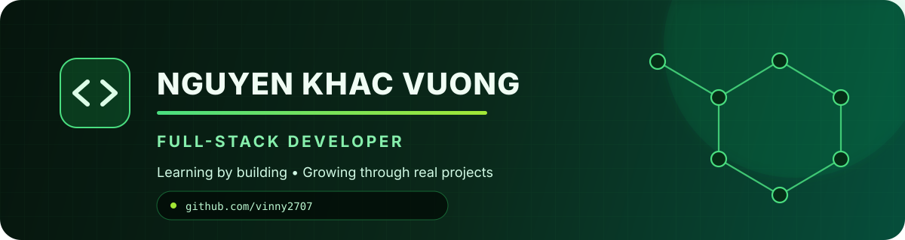

<div align="center">
  

  <br />

  <a href="https://github.com/vinny2707?tab=followers">
    
  </a>
  
</div>

## Hello, I'm Vượng 👋

I'm a developer who learns by building real products. I enjoy connecting polished web interfaces with practical backend systems, and I'm currently growing toward full-stack development and DevOps.

- 💻 Building full-stack applications and planning my personal portfolio website
- 🌱 Deepening my knowledge of React, TypeScript, NestJS, PostgreSQL, and MongoDB
- ☸️ Exploring Docker, Kubernetes, CI/CD, and microservice deployment
- 🧠 Strengthening my foundations in C++, networking, sockets, and clean code
- 🤝 Open to learning, collaborating, and creating useful software

## Tech toolbox

<table>
  <tr>
    <th>Frontend</th>
    <th>Backend</th>
    <th>Data &amp; Systems</th>
    <th>DevOps &amp; Tools</th>
  </tr>
  <tr>
    <td align="center">
      
    </td>
    <td align="center">
      
    </td>
    <td align="center">
      
    </td>
    <td align="center">
      
    </td>
  </tr>
</table>

## What I'm working toward

```text
Learn deeply  ➜  Build practically  ➜  Ship reliably  ➜  Improve continuously
```

My goal is to become a well-rounded developer who can take an idea from interface to backend and deployment. I'm also preparing to build a personal portfolio website where I can present my work, skills, and learning journey in more depth.

## Contribution journey


## Let's connect

<div align="center">
  <a href="https://www.linkedin.com/in/kh%E1%BA%AFc-v%C6%B0%E1%BB%A3ng-nguy%E1%BB%85n-5b1736370/">
    
  </a>
  <a href="https://github.com/vinny2707">
    
  </a>
</div>

<br />

<p align="center"><sub>Still learning. Always building. One commit at a time. 🌱</sub></p>
